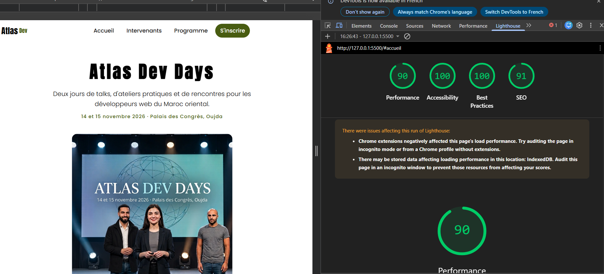

# Atlas Dev Days

Site web de la conférence **Atlas Dev Days** : deux jours de talks, d'ateliers pratiques et de rencontres pour les développeurs web du Maroc oriental.

📅 14 et 15 novembre 2026 — Palais des Congrès, Oujda

## Pages

Le site est une page unique avec quatre sections, accessibles depuis le menu :

- **Accueil** : présentation de la conférence et galerie d'images
- **Intervenants** : les six speakers et le sujet de leur talk
- **Programme** : le déroulé des Jour 1 et Jour 2
- **S'inscrire** : formulaire d'inscription avec validation des champs


## Structure du projet

```
atlas-dev/
├── index.html
├── README.md
├── css/
│   └── style.css
└── assets/
    ├── icons/
    └── images/
```

## ouvrir le projet
    
    Ouvrir `https://iaboudou.github.io/atlas-dev/` dans un navigateur.


## Performance

Le site a été testé avec Google Lighthouse pour évaluer ses performances, son accessibilité, les bonnes pratiques et le référencement SEO.

